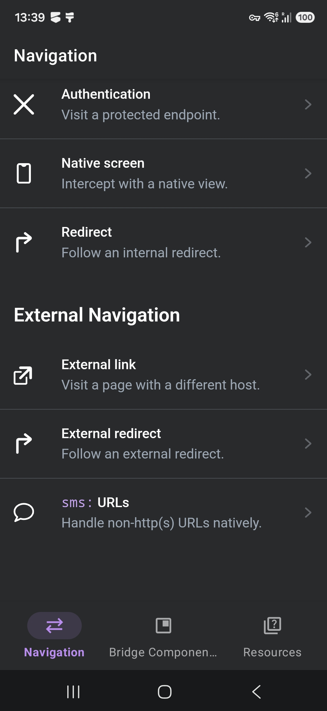

# Inertia Hotwire Native Demo (Android)

A minimal Android app demonstrating [Hotwire Native](https://native.hotwired.dev) driving an
[Inertia](https://inertiajs.com)-powered web app. It wraps a server-rendered site in a native
shell, adds native navigation/tabs, intercepts selected routes with native screens, and exposes
native UI to the web layer through bridge components.

The app loads **https://demo.inertia-native.dev** by default.

> [!NOTE]
> This project started as a copy of the official
> [Hotwire Native Android demo](https://github.com/hotwired/hotwire-native-android/tree/main/demo)
> and is currently almost identical to it, adapted to point at an Inertia-powered backend.
> See [Credits](#credits).

<p align="center">
  
</p>

## Requirements

- Android Studio (latest stable)
- JDK 17
- Android Gradle Plugin 9.2.1 / Gradle 9.4.1 / Kotlin 2.2.0
- `compileSdk` 36, `minSdk` 28

Dependencies are managed with **Gradle** and resolve automatically on first build. The main
dependencies are [`hotwire-native-android`](https://github.com/hotwired/hotwire-native-android)
(`core` and `navigation-fragments`, pinned to `1.2.8`) and [Coil](https://coil-kt.github.io/coil/)
for image loading.

## Running

1. Open the project in Android Studio.
2. Select the `app` run configuration and a device or emulator.
3. Build & Run (▶).

Or from the command line:

```bash
./gradlew :app:installDebug
```

### Pointing at a local server

By default the app talks to the hosted demo. To run against a local Inertia/Rails server,
edit `Demo.kt` and switch the environment:

```kotlin
val current: Environment = Environment.Local   // http://10.0.2.2:3000
```

`10.0.2.2` is the Android emulator's alias for the host machine's `localhost`.

## How it works

- **`DemoApplication.kt`** — configures Hotwire: loads the path configuration, registers fragment
  destinations and bridge components, and sets global options (JSON converter, user-agent prefix,
  debug logging).
- **`main/MainActivity.kt`** — sets up the `HotwireActivity` with a bottom tab bar and the
  navigator hosts.
- **`main/MainTabs.kt`** — defines the native bottom navigation tabs.
- **`assets/json/path-configuration.json`** — declarative rules: present `/new`, `/edit`, `/modal`
  as modals; render `/numbers` with a native fragment; open images in a native viewer; reset the
  stack at root. Merged with a server-hosted configuration at `configurations/android_v1.json`.
- **`features/numbers/NumbersFragment.kt`** — example of a fully native screen replacing a web route.
- **`bridge/`** — bridge components that let the web page drive native UI:
  - `FormComponent` — native toolbar submit button wired to a web form.
  - `MenuComponent` / `OverflowMenuComponent` — native menus populated from the web.

## Project structure

```
app/src/main/
├── AndroidManifest.xml
├── assets/json/
│   └── path-configuration.json          # Routing/presentation rules
├── kotlin/dev/inertia/demo/
│   ├── DemoApplication.kt               # Hotwire configuration
│   ├── Demo.kt                          # Base URL (remote/local switch)
│   ├── main/
│   │   ├── MainActivity.kt              # HotwireActivity + tabs
│   │   ├── MainActivityViewModel.kt
│   │   └── MainTabs.kt                  # Native tab definitions
│   ├── features/
│   │   ├── numbers/                     # Native screen for /numbers
│   │   ├── web/                         # Web fragment destinations
│   │   └── imageviewer/                 # Native image viewer
│   └── bridge/                          # Bridge components (web ↔ native)
│       ├── FormComponent.kt
│       ├── MenuComponent.kt
│       └── OverflowMenuComponent.kt
└── res/                                 # Layouts, drawables, themes
```

## Credits

Based on the official [Hotwire Native Android demo](https://github.com/hotwired/hotwire-native-android/tree/main/demo)
by [Hotwire](https://hotwired.dev), also released under the MIT License.
This repository adapts it to demonstrate an [Inertia](https://inertiajs.com)-powered backend.

## License

Released under the [MIT License](LICENSE).
